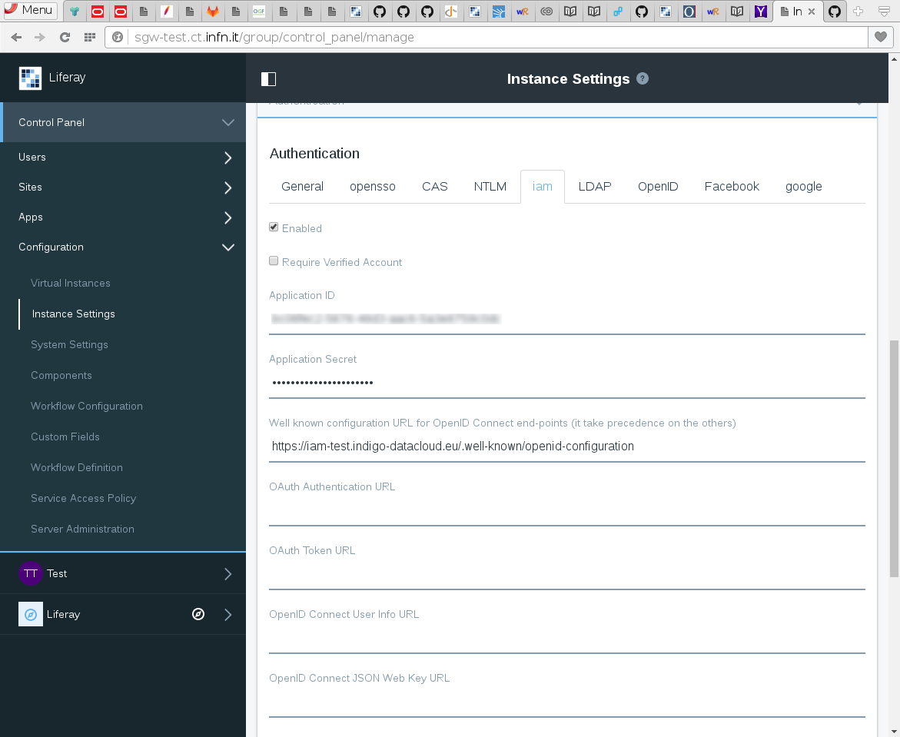
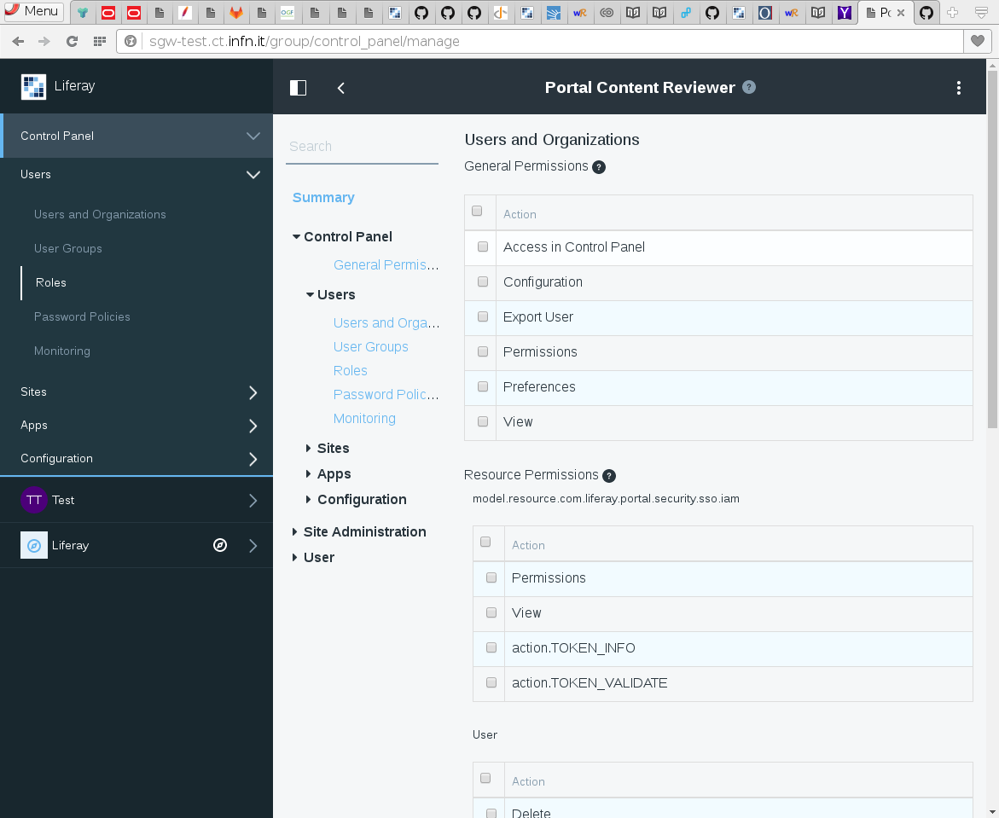

# Administration Guide

To deploy the modules and make available INDIGO-AAI in Liferay the five jar modules included in the release have to uploaded
into the service. Module upload page is available in `Liferay > Control Panel > Apps > App Manager`.

After the modules are deployed the new IAM authentication configuration should be available in the control panel going
to `Liferay > Control Panel > Configuration > Instance Settings` and open the section authentication. The following picture
shows the configuration made with the IAM-Test instance:

To work with the test configuration it is enough to provide the application identifier (application id and secret) and
the URL of the well known OpenId Connect configuration. For the IAM test the URL is:
[https://iam-test.indigo-datacloud.eu/.well-known/openid-configuration](https://iam-test.indigo-datacloud.eu/.well-known/openid-configuration)

It is possible to require some extra scopes for the token but the default configuration will require the scopes for the user
identification as requested by Liferay (name, mail and other attributes) and the refresh token.

Checking the enable check will make the authentication method available to the user.

If a user has to use the reserved remote method (to retrieve user token and/or validate them) the account has to be authorised.
The best way is to create a special role and assign this rule to the user of a group of user. The role has to enable the access
to this method. This can be configured going to the page `Liferay > Control Panel > Users > Roles`. Create a new role and then
open the `Define Permissions` dialog which will show the authorisation for the iam related method under the *Users and Organisations*
group, as shown in the following picture:

Enable the permissions for the `model.resource.com.liferay.portal.security.sso.iam` among the *Resource Permissions* and
everyone with this role can access the remote methods.
